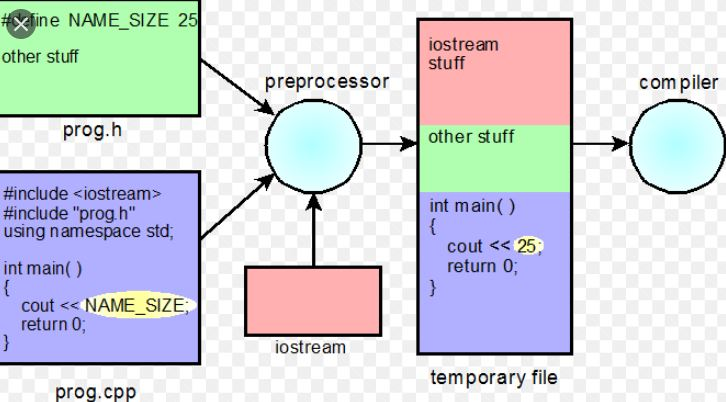

Source code -> Preprocess time -> Compiler -> Linker -> Executable (machine code)
<br/>

<br/>

# Preprocessor

* #include
* pragma once (conditional check)

## pragma region

```c++
#pragma region
 // code you want to hide from visual studio
#pragma endregion
```

## macro
* replacing a small chunk of code with a big chunk of code
* no ability to have a breakpoint inside of the macro
* ability to pass different types of data into the macro
* you can use conditional turnary operator for macros as well.

#### text book definition
* define a small identifier that gets replaced with something else

#### Macro breakdown
```c++
// old method 
#define(preprocessor directive) GOAL_SCORE(macro identifier) 7(what the macro gets replaced with)

// new way
cosntexpr <GoalScore> = 7;
// equivalent
if (score >= 7)
int score = GetScore();
```
<br/>
* variable use for marcos

```c++
#define PRINT(message) std::cout << message << std::endl;

// easy use
PRINT("hello world");
```